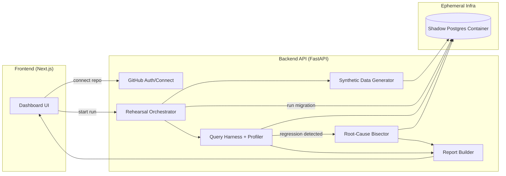
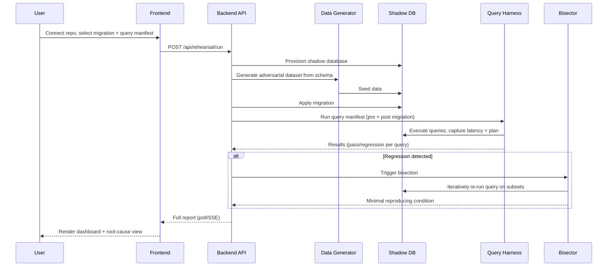

# architecture.md — Migration Rehearsal Agent

## 1. System overview

## 2. Components

### 2.1 Frontend (Next.js + React)
Single-page dashboard. Renders live run progress (via polling or SSE), the results table, and the root-cause drill-down view. See `ui_ux.md` for full screen specs.

### 2.2 Backend API (FastAPI, Python)
Stateless HTTP layer. Owns:
- GitHub integration (OAuth read-only, pull migration files + schema DDL).
- Run lifecycle orchestration (state machine: `queued → provisioning → seeding → migrating → querying → bisecting? → done`).
- Persisting run history/results (SQLite for MVP, swappable to Postgres).

### 2.3 Synthetic Data Generator
Given a schema (introspected DDL: column names, types, constraints, nullability, foreign keys), generates rows across configurable "hostility" profiles:
- **Null pressure** — populate nullable columns with NULL at a higher-than-typical rate.
- **Duplication** — near-duplicate rows differing in one low-cardinality field.
- **Legacy format drift** — a subset of rows use an older format for a field (e.g. date as string vs. timestamp, a deprecated enum value).
- **Skew** — heavy concentration of rows on a small number of foreign key values (hot partitions).
- **Scale** — total row count large enough to expose index/plan behavior (default: 500k–2M rows per table, configurable).

Implementation: Python + `Faker` for realistic base values, custom "corruption" pass layered on top per profile.

### 2.4 Shadow Database Provisioning
Ephemeral Postgres instance per run, provisioned via Docker (local/dev) or a short-lived container on Fly.io/Railway (hosted demo). Each run gets an isolated database; torn down after report generation (or kept briefly for the "live container repro" link).

### 2.5 Query Harness + Profiler
Runs a user-supplied **query manifest** (a small YAML/SQL file of representative queries) against the shadow DB before and after migration. Captures:
- Latency (wall clock, multiple runs, median reported).
- Query plan (`EXPLAIN ANALYZE`).
- Result shape (row count, checksum) to catch correctness regressions, not just performance ones.

### 2.6 Root-Cause Bisector
Triggered when a query regresses beyond a threshold (default: >3x latency or plan change from index scan → seq scan). Performs a delta-debugging-style bisection over the synthetic dataset's row set: repeatedly re-runs the query against shrinking/partitioned subsets of the data to isolate the minimal condition (e.g. a `WHERE` predicate over one or two columns) that reproduces the regression.

### 2.7 Report Builder
Assembles the final artifact: pass/fail per query, the offending condition in plain language, the before/after `EXPLAIN` diff, and an exportable minimal-repro SQL script.

## 3. Data flow (single run)

## 4. Tech stack

| Layer | Choice | Why |
|---|---|---|
| Frontend | Next.js, React, Tailwind, Framer Motion | Fast to build, animation support for the progress/root-cause views (see `ui_ux.md`). |
| Backend | FastAPI (Python) | Async-friendly, easy to pair with data-gen tooling in Python. |
| Data generation | Python + Faker + custom corruption layer | Mature ecosystem for realistic fake data; corruption layer is bespoke. |
| Database (target) | PostgreSQL | Most common OSS relational DB; `EXPLAIN ANALYZE` gives rich plan data. |
| Shadow provisioning | Docker (local), Fly.io/Railway (hosted) | Free-tier friendly, fast cold start for ephemeral containers. |
| Persistence (run history) | SQLite (MVP) → Postgres (post-MVP) | Zero-ops for a hackathon build. |
| Realtime updates | Server-Sent Events (SSE) | Simpler than WebSockets for one-directional progress streaming. |

## 5. Key design decisions

- **Schema-driven, not demo-hardcoded.** The generator reads real DDL and infers corruption strategy per column type — this is what makes the "Feasibility & Scalability" story credible instead of a canned example.
- **Bisection is a real algorithm, not a lookup.** It performs iterative subset re-execution against the live shadow DB; the result is discovered at run time, not pre-baked.
- **Everything ephemeral.** No shadow database persists beyond a run's lifetime — this keeps the infra footprint (and cost) near zero, which matters for a free-tier deployable demo.

## 6. Scaling beyond the hackathon

- Swap SQLite → Postgres for run history at multi-user scale.
- Move shadow provisioning to a pooled/warm container strategy to cut cold-start latency.
- Add MySQL/other engine adapters behind the same generator/harness interfaces.
- Package the orchestrator as a GitHub Action for CI-native gating.
